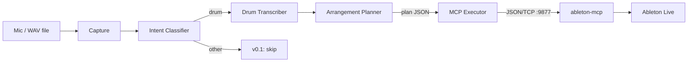

# Mouthflow

**A voice-driven arrangement agent for Ableton Live.**
Beatbox a rhythm, get a drum pattern in your session. That's it.

- **Status:** v0 spec, pre-code
- **License:** MIT
- **Language:** Python 3.11
- **Platform:** macOS / Linux / Windows
- **Requires:** Ableton Live 11+, an Anthropic API key, a microphone

---

## Thesis

Every primitive for this exists — DAW MCPs, audio-to-MIDI, pretrained drum classifiers, speech models. What's missing is the **agent with musical judgment** that stitches them together. Build that. Rent everything else.

Corollary: if this spec tempts you to re-implement a primitive, resist. Own the taste, rent the pipes.

---

## v0.1 scope

| | |
|---|---|
| **In** | Offline one-shot: record a 5–30s vocal clip, get a drum pattern in Ableton |
| **Out** | Realtime, pitched transcription (bass/lead), multi-turn, arrangement-view edits, Logic Pro, any GUI |
| **Target user** | Rene, then anyone who'll install Python and Ableton |
| **Success** | Beatbox 8 bars → Ableton shows a populated drum rack playing a MIDI clip that matches intent. Gut-check: *"tweak this or start from scratch?"* Answer must be **tweak.** |

---

## Non-goals (explicit)

- Realtime streaming. Offline first. Realtime is v1 at earliest.
- Our own DAW bridge. Use [`ahujasid/ableton-mcp`](https://github.com/ahujasid/ableton-mcp) as-is.
- Our own onset detector. Use `librosa`.
- Our own drum classifier trained from scratch in v0.1. Heuristics first.
- A hosted service. CLI + local Python only. No FastAPI, no Railway, no accounts.
- A GUI. CLI is final form for v0.1.

---

## Architecture



Six modules, each independently runnable and testable. The Arrangement Planner is the only piece that calls an LLM. Everything else is deterministic Python.

**Execution model:** no server. CLI process spawns, runs the pipeline, exits. `ableton-mcp` runs locally as a Remote Script inside Live; we talk to its socket directly rather than going through an MCP host. This keeps v0.1 dependency-free of Claude Desktop / Cursor.

---

## Repository layout

```
mouthflow/
├── README.md
├── LICENSE                     # MIT
├── pyproject.toml              # uv / hatch
├── mouthflow/
│   ├── __init__.py
│   ├── capture.py              # sounddevice recorder
│   ├── classify.py             # intent classifier (heuristic v0.1)
│   ├── transcribe.py           # onset detection + drum classification → MIDI
│   ├── plan.py                 # Claude call, returns structured plan
│   ├── execute.py              # ableton-mcp socket client
│   ├── schemas.py              # pydantic models for plan JSON
│   ├── prompts/
│   │   └── plan.md             # arrangement planner system prompt
│   └── cli.py                  # `mouthflow record`, `mouthflow run <wav>`
├── tests/
│   ├── fixtures/clips/         # 20 labelled beatbox WAVs + ground-truth MIDI
│   ├── test_capture.py
│   ├── test_transcribe.py
│   ├── test_plan.py
│   ├── test_execute.py         # mocks the socket
│   └── test_e2e.py             # full pipeline, mocked LLM + socket
├── eval/
│   ├── run_eval.py             # runs pipeline over fixtures, computes metrics
│   ├── baseline_ableton.py     # Ableton native "convert drums to MIDI" for A/B
│   └── taste_review.py         # interactive 1–5 rater
└── docs/
    ├── spec.md                 # this document
    └── corpus.md               # how to label a new clip
```

---

## Tech stack

| Layer | Choice | Why |
|---|---|---|
| Package mgr | `uv` | Fast, familiar |
| Audio I/O | `sounddevice`, `soundfile` | Cross-platform, no system deps |
| DSP | `librosa` 0.10+, `numpy`, `scipy` | Standard MIR stack |
| MIDI | `mido` | Simple, pure Python |
| LLM | `anthropic` SDK, `claude-sonnet-4-6` | Good cost/capability for structured output |
| Validation | `pydantic` v2 | Plan schema enforcement |
| CLI | `typer` | Minimal boilerplate |
| DAW bridge | `ahujasid/ableton-mcp` | Install separately; we speak its socket protocol |
| Tests | `pytest`, `pytest-asyncio` | Nothing fancy |

Pin exact versions in `pyproject.toml`. No range specifiers.

---

## Component specs

### 1. `capture.py`

**Responsibility:** record audio from default input, return path to WAV.

```python
def record(duration_s: float = 15.0, out_path: Path | None = None) -> Path: ...
def from_file(path: Path) -> Path:  # validates, normalises to 44.1/16/mono
    ...
```

**Acceptance:** `record(5.0)` produces a 5-second WAV at 44.1 kHz, 16-bit, mono. `from_file` rejects non-audio and resamples if needed.

### 2. `classify.py`

**Responsibility:** classify intent of a WAV.

```python
class Intent(str, Enum):
    DRUM = "drum"
    MELODY = "melody"
    BASS = "bass"
    UNKNOWN = "unknown"

def classify(wav_path: Path) -> tuple[Intent, float]: ...  # (intent, confidence)
```

**v0.1 implementation:** hardcode `return (Intent.DRUM, 1.0)`. Leave a TODO with the heuristic sketch: onset density > 3/s + pitch stability low → drum.

**Acceptance:** returns `DRUM` for v0.1. The interface is what matters — a real classifier slots in for v0.2.

### 3. `transcribe.py`

**Responsibility:** beatbox WAV → drum MIDI + tempo.

```python
@dataclass
class Transcription:
    midi_path: Path          # GM drum map, channel 10
    tempo_bpm: float
    bars: float
    hits: list[DrumHit]      # for debugging / re-planning

def transcribe_drums(wav_path: Path) -> Transcription: ...
```

**Pipeline:**
1. `librosa.onset.onset_detect(backtrack=True)`
2. For each onset, slice ~120ms window, compute features: spectral centroid, spectral flatness, zero-crossing rate, RMS, sub-100Hz energy ratio.
3. Heuristic classifier (decision tree, hand-tuned):
   - Low centroid + high sub-100Hz → `kick (36)`
   - Mid centroid + noisy + mid-energy → `snare (38)`
   - High centroid + short decay → `hat-closed (42)`
   - High centroid + long decay → `hat-open (46)`
   - Else → `perc (39)` or drop
4. `librosa.beat.beat_track` for tempo.
5. Quantise onsets to 16th notes at detected tempo.
6. Write MIDI via `mido`.

**Acceptance:** onset F1 ≥ 0.75 and drum-class top-1 accuracy ≥ 0.65 on the 20-clip eval set. Tempo within ±3 BPM of ground truth on ≥ 80% of clips.

### 4. `plan.py`

**Responsibility:** take a `Transcription` + current Ableton session state, return a structured plan.

```python
class ClipPlan(BaseModel):
    track_name: str
    instrument_path: str           # e.g. "Drums/Kit-Core 808"
    midi_file: Path
    length_bars: float

class Plan(BaseModel):
    tempo: float
    clips: list[ClipPlan]
    rationale: str                 # 1–2 sentences, for logging

def make_plan(
    transcription: Transcription,
    session_state: dict,
    user_hint: str | None = None,
) -> Plan: ...
```

**Implementation:** single Claude call using tool-use with strict JSON schema (derived from the pydantic models). System prompt frames the model as "a producer choosing a drum kit and cleaning up a transcribed pattern." User turn includes: transcription summary (tempo, density, swing estimate, hit histogram), list of available instruments from `session_state`, optional user hint.

**The prompt lives in `mouthflow/prompts/plan.md`** so it can be iterated without touching code.

**Acceptance:** validated `Plan` object returned in ≥ 95% of calls (schema compliance). Picked instrument exists in `session_state.available_instruments` in ≥ 90% of calls.

### 5. `execute.py`

**Responsibility:** apply a `Plan` to a running Ableton Live session via ableton-mcp's socket.

```python
class AbletonClient:
    def __init__(self, host="127.0.0.1", port=9877): ...
    def get_session_info(self) -> dict: ...
    def create_midi_track(self, name: str) -> int: ...   # returns track index
    def load_instrument(self, track_idx: int, path: str) -> None: ...
    def insert_midi_clip(self, track_idx: int, midi_path: Path, bars: float) -> None: ...
    def set_tempo(self, bpm: float) -> None: ...
    def fire_clip(self, track_idx: int, clip_idx: int = 0) -> None: ...

def apply_plan(plan: Plan, client: AbletonClient) -> None: ...
```

**Implementation:** `ableton-mcp` speaks JSON over TCP on port 9877. Wrap each command as `{"type": "<cmd>", "params": {...}}` per its protocol. Raise on non-`status: ok` responses.

**Acceptance:** integration test (manual, documented in `tests/README.md`) applies a fixture plan to an empty Live set and produces the expected tracks and clips.

### 6. `cli.py`

```bash
mouthflow record               # 15s capture → pipeline → execute
mouthflow run path/to/clip.wav # skip capture
mouthflow dry-run clip.wav     # run pipeline, print Plan, don't execute
```

Uses `typer`. Logs to stderr, Plan JSON to stdout on `--json`.

---

## The corpus (do this first, before code)

Record **20 beatbox clips of your own**. For each, hand-transcribe the drums you *meant* in Ableton, export MIDI, save alongside the WAV:

```
tests/fixtures/clips/
├── 01_basic_4to4.wav
├── 01_basic_4to4.mid
├── 01_basic_4to4.json          # {tempo, style, notes}
├── 02_trap_hats.wav
├── 02_trap_hats.mid
└── ...
```

Aim for variety: tempos from 70–160 BPM, styles from boom-bap to drum-n-bass to breakbeat, clean and sloppy performances both.

**This is the eval set, the ground truth, and your taste made explicit.** Two evenings, maybe three. Do it before writing `transcribe.py` — the fixtures drive the implementation.

`docs/corpus.md` documents the labelling convention for future contributors.

---

## Eval harness

`eval/run_eval.py` produces a single report:

```
MOUTHFLOW EVAL — 2026-04-22
────────────────────────────
Transcription (N=20)
  onset F1:         0.78   ✓ (target 0.75)
  drum class acc:   0.71   ✓ (target 0.65)
  tempo within ±3:  17/20  ✓ (target 16/20)

Plan (N=20)
  schema valid:     20/20  ✓
  instrument real:  19/20  ✓

Taste (A/B vs Ableton native, N=20, rater=self)
  Mouthflow win:    11
  Tie:              4
  Ableton win:      5      ✓ (target: ≥ 9 wins)
```

Taste review is interactive: `eval/taste_review.py` plays both clips back-to-back, prompts a 1–5 rating, writes to CSV.

**Ship gate for v0.1:** all targets above hit.

---

## Roadmap

| | Scope | Est. |
|---|---|---|
| **v0.1** | Drum loops. Heuristic classifier + transcriber. LLM picks kit. | 2 weekends |
| **v0.2** | Real drum classifier trained on corpus (200+ clips). Pitched intent class → basslines via Basic Pitch. | 1 month |
| **v0.3** | Multi-turn conversational mode. Context accumulates: "now harder", "add hats", "swap to breakbeat". | +1 month |
| **v0.4** | Arrangement-view edits: intro/verse/chorus from a single vocal sketch. Requires ableton-mcp fork. | +2 months |
| **v1.0** | Realtime streaming path. Logic Pro support (behind experimental flag). Public beta, first community contributors. | Open |

---

## Open questions (punt, but note)

1. **Arrangement-view support in ableton-mcp is thin.** We'll hit this at v0.4 and need to either fork or PR upstream.
2. **Realtime rewrite.** Offline → realtime isn't a refactor, it's a rewrite of capture + transcribe + plan as streaming. Plan accordingly at v1.
3. **Ableton's licensing stance on third-party remote scripts.** Low risk for OSS; re-check before anyone ships a paid layer on top.

---

## Getting started (first PR)

For the coding agent picking this up:

1. `uv init mouthflow && cd mouthflow`
2. Create the directory tree above. Empty `__init__.py` and placeholder modules.
3. Fill `pyproject.toml` with pinned deps from the stack table.
4. **Do not write `transcribe.py` yet.** Start with `tests/fixtures/clips/` — Rene supplies the 20 clips + hand-labelled MIDI. Commit them.
5. Then `capture.py` + `test_capture.py`. Trivial, but gets the loop green.
6. Then `execute.py` + `test_execute.py` with socket mocks. Second trivial one.
7. Then `transcribe.py`, driven by the fixture tests. **This is where the real work starts.**
8. Then `plan.py`. Prompt goes in `mouthflow/prompts/plan.md`. Include 2–3 few-shot examples drawn from the corpus.
9. Then `cli.py`. Glue.
10. Then `eval/run_eval.py`. Run it. Iterate on `transcribe.py` and `plan.md` until the ship gate hits.

**First commit message:** `chore: initial project structure per spec v0`.

---

## License & contributing

MIT. No CLA. Standard `CONTRIBUTING.md`:

- Run `uv sync && pytest` before opening a PR.
- New corpus clips welcome; see `docs/corpus.md`.
- Prompt changes go in `mouthflow/prompts/`, not code.

Code of conduct: Contributor Covenant v2.1, boilerplate.

---

*Name is a placeholder. Rename before the first public commit if a better one shows up.*
